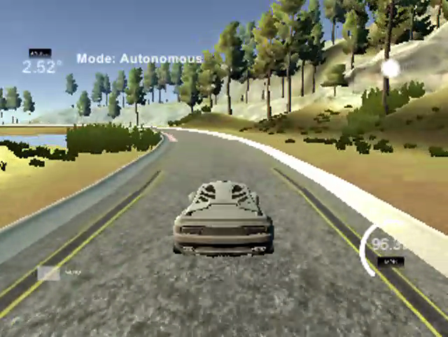

# CarND-Controls-PID
Self-Driving Car Engineer Nanodegree Program

---
## Implementation details

In this implementation, I could get the car to reach 96.5 MPH (see video below).
The program implements a PID controller to generate steering angles and a PD controller for generating throttle values in response to telemetry requests from the simulator.

### Steering control
Kp, Kd values were selected after extensive `twiddling` using the algorithm described below.
Ki value was hand-picked to smooth turns on curved sections of road.
The values were selected so that the car performs reasonably well at different speeds and for different simulator settings.

### Speed Control
Selecting the correct speed is a key function of the program. The function `computeTargetSpeed` allows us to target higher speeds on straight segments of track and drop the speed when making a sharp turn.
The function sets target speed based on:

- Telemetry frequency 
- Steering angle

Speed is reduced when the car is making turns:

- Reduce speed by 10% for steering angles > 0.2
- Reduce speed by 20% for steering angles > 0.3
- Reduce speed by 50% for steering angles > 0.4

Speed is also reduced when the polling frequency is low. Polling frequency drops when the simulator runs on a slow PC or user selected larger or higher quality rendering.
Higher the polling frequency, the more control we have over the car, so the faster we can go.
The class `event_freq` is used to track polling frequency so we can adjust target speed.
Here are the adjustments based on polling frequency:

- Target 100 mph when polling frequency > 35 calls / sec
- Target 80 mph when polling frequency > 30 calls / sec
- Target 50 mph when polling frequency > 20 calls / sec
- Target 40 mph if it is slower

## Twiddle
I implemented twiddle as a sub-class of PID controller called `twiddler`. The class unrolls twiddle loop into a simple state machine.
The car is run on the simulator track for up to 2000 telemetry calls or a crash occurs.

### Error metric
After each run, the twiddle algorigthm executes one additional interation of the loop, adjusting Kp, Kd values based on an `error` value computed during the run.

`error = sum of squares of cte values / square of number of telemetry calls`

Squaring the number of calls has the effect of penalising crashes that occur sooner and rewarding longer runs.

### Crash detection
The car is considered crashed if (a) the CTE is too high (5) - that is, the car has left the track or (b) the speed drops to less than 0.1 (when sometimes it gets stuck on the curb)

## Results

---

## Dependencies

* cmake >= 3.5
 * All OSes: [click here for installation instructions](https://cmake.org/install/)
* make >= 4.1
  * Linux: make is installed by default on most Linux distros
  * Mac: [install Xcode command line tools to get make](https://developer.apple.com/xcode/features/)
  * Windows: [Click here for installation instructions](http://gnuwin32.sourceforge.net/packages/make.htm)
* gcc/g++ >= 5.4
  * Linux: gcc / g++ is installed by default on most Linux distros
  * Mac: same deal as make - [install Xcode command line tools]((https://developer.apple.com/xcode/features/)
  * Windows: recommend using [MinGW](http://www.mingw.org/)
* [uWebSockets](https://github.com/uWebSockets/uWebSockets) == 0.13, but the master branch will probably work just fine
  * Follow the instructions in the [uWebSockets README](https://github.com/uWebSockets/uWebSockets/blob/master/README.md) to get setup for your platform. You can download the zip of the appropriate version from the [releases page](https://github.com/uWebSockets/uWebSockets/releases). Here's a link to the [v0.13 zip](https://github.com/uWebSockets/uWebSockets/archive/v0.13.0.zip).
  * If you run OSX and have homebrew installed you can just run the ./install-mac.sh script to install this
* Simulator. You can download these from the [project intro page](https://classroom.udacity.com/nanodegrees/nd013/parts/40f38239-66b6-46ec-ae68-03afd8a601c8/modules/aca605f8-8219-465d-9c5d-ca72c699561d/lessons/e8235395-22dd-4b87-88e0-d108c5e5bbf4/concepts/6a4d8d42-6a04-4aa6-b284-1697c0fd6562) in the classroom.

## Basic Build Instructions

1. Clone this repo.
2. Make a build directory: `mkdir build && cd build`
3. Compile: `cmake .. && make`
4. Run it: `./pid`. 

## Editor Settings

We've purposefully kept editor configuration files out of this repo in order to
keep it as simple and environment agnostic as possible. However, we recommend
using the following settings:

* indent using spaces
* set tab width to 2 spaces (keeps the matrices in source code aligned)

## Code Style

Please (do your best to) stick to [Google's C++ style guide](https://google.github.io/styleguide/cppguide.html).

## Project Instructions and Rubric

Note: regardless of the changes you make, your project must be buildable using
cmake and make!

More information is only accessible by people who are already enrolled in Term 2
of CarND. If you are enrolled, see [the project page](https://classroom.udacity.com/nanodegrees/nd013/parts/40f38239-66b6-46ec-ae68-03afd8a601c8/modules/f1820894-8322-4bb3-81aa-b26b3c6dcbaf/lessons/e8235395-22dd-4b87-88e0-d108c5e5bbf4/concepts/6a4d8d42-6a04-4aa6-b284-1697c0fd6562)
for instructions and the project rubric.

## Hints!

* You don't have to follow this directory structure, but if you do, your work
  will span all of the .cpp files here. Keep an eye out for TODOs.

## Call for IDE Profiles Pull Requests

Help your fellow students!

We decided to create Makefiles with cmake to keep this project as platform
agnostic as possible. Similarly, we omitted IDE profiles in order to we ensure
that students don't feel pressured to use one IDE or another.

However! I'd love to help people get up and running with their IDEs of choice.
If you've created a profile for an IDE that you think other students would
appreciate, we'd love to have you add the requisite profile files and
instructions to ide_profiles/. For example if you wanted to add a VS Code
profile, you'd add:

* /ide_profiles/vscode/.vscode
* /ide_profiles/vscode/README.md

The README should explain what the profile does, how to take advantage of it,
and how to install it.

Frankly, I've never been involved in a project with multiple IDE profiles
before. I believe the best way to handle this would be to keep them out of the
repo root to avoid clutter. My expectation is that most profiles will include
instructions to copy files to a new location to get picked up by the IDE, but
that's just a guess.

One last note here: regardless of the IDE used, every submitted project must
still be compilable with cmake and make./
